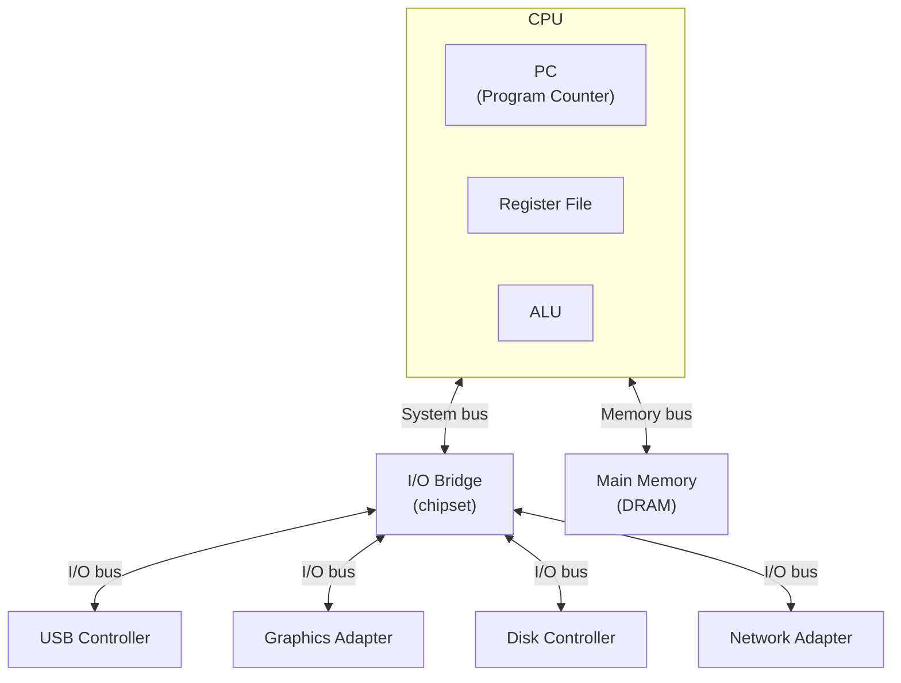
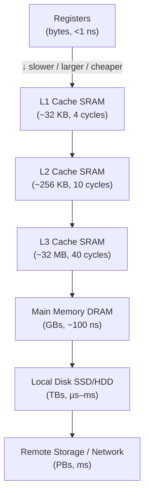

> **Source:** *Computer Systems: A Programmer's Perspective* (3rd ed.) by Randal E. Bryant and David R. O'Hallaron (Pearson, 2015), §1.1–1.6. These are personal study notes. All original content is copyright the authors and publisher.

---

## Information is bits in context

A C source file is a sequence of bits organised into 8-bit bytes. The source file is a **text file** (ASCII throughout). Everything else — executables, images, packets — is a **binary file**.

The fundamental point: all information in a computer system is represented as a sequence of bits. What distinguishes one from another is **context** — the type tells you how to interpret the bits.

```
01001000 01100101 01101100 01101100 01101111
   H         e        l        l        o
```

The same 40 bits could be a 5-character ASCII string, a 40-bit unsigned integer, or part of a machine instruction. **The bits carry no inherent meaning. Context gives them meaning.** This is the first principle behind static typing.

---

## The compilation pipeline

A C program goes through four transformation stages before it runs:

| Stage | Tool | Input | Output | What it does |
|-------|------|-------|--------|--------------|
| Preprocessing | `cpp` | `hello.c` | `hello.i` | Expands `#include`, `#define` macros |
| Compilation | `cc1` | `hello.i` | `hello.s` | Translates C to assembly |
| Assembly | `as` | `hello.s` | `hello.o` | Translates assembly to machine code |
| Linking | `ld` | `hello.o`, libs | `hello` | Merges object files, resolves library references |

Link errors (undefined reference) happen at the last stage — the compiler succeeded but the linker couldn't find a function. Go's `go build` runs all four stages; the output is a statically linked binary by default.

---

## Hardware organisation



**Buses** carry fixed-size chunks called words. Word size is 4 bytes on 32-bit systems, 8 bytes on 64-bit.

**CPU internals:**
- **PC (program counter)** — register holding the address of the *next* instruction to execute
- **Register file** — a small collection of word-size registers; the fastest storage in the hierarchy
- **ALU** — computes arithmetic and logical results

**The fetch/decode/execute loop:**
```
1. Fetch   — read the instruction at the address in PC
2. Decode  — determine the operation and operands
3. Execute — ALU computes; load/store moves data; branch updates PC
4. Repeat
```

The **instruction set architecture (ISA)** is the contract between software and hardware — the defined set of instructions and their effects. x86-64 (Intel/AMD laptops) and ARM64 (Apple Silicon, phones) are the two dominant ISAs today.

---

## Why caches exist

Every data transfer costs time. The processor runs at ~3GHz; DRAM takes ~100ns (~300 clock cycles) per access. That gap is the memory wall.

| Storage | Size | Access time |
|---------|------|-------------|
| CPU registers | bytes | < 1 ns |
| L1 cache (SRAM) | ~32 KB | ~4 cycles |
| L2 cache (SRAM) | ~256 KB | ~10 cycles |
| L3 cache (SRAM) | ~8–32 MB | ~40 cycles |
| Main memory (DRAM) | GBs | ~100 ns |
| SSD | TBs | ~100 µs |
| HDD | TBs | ~10 ms |

A cache is a smaller, faster storage device that stages data the processor is likely to need again. The hardware exploits two properties of real programs:

- **Temporal locality** — recently accessed data will likely be accessed again soon
- **Spatial locality** — data near recently accessed data will likely be accessed soon

Sequential array traversal exploits spatial locality and is dramatically faster than random pointer chasing. A single L3 cache miss costs ~300 cycles.

---

## The storage hierarchy



Every level of the hierarchy serves as a **cache for the level below it**. This principle recurrs everywhere in systems:

- A database buffer pool is software caching hot pages in RAM
- Redis is a cache in front of a database
- A CDN is a cache in front of an origin server

---

## Key takeaways

- All information is bits; **type (context) gives them meaning** — the first-principles foundation for static typing
- Source code goes through preprocessing → compilation → assembly → linking before running
- CPU executes a fetch/decode/execute loop; the PC tracks the current instruction
- Storage hierarchy: registers < L1 < L2 < L3 < DRAM < SSD < disk < network; each level caches the next
- Sequential access (spatial locality) is fast; random access breaks cache behaviour
