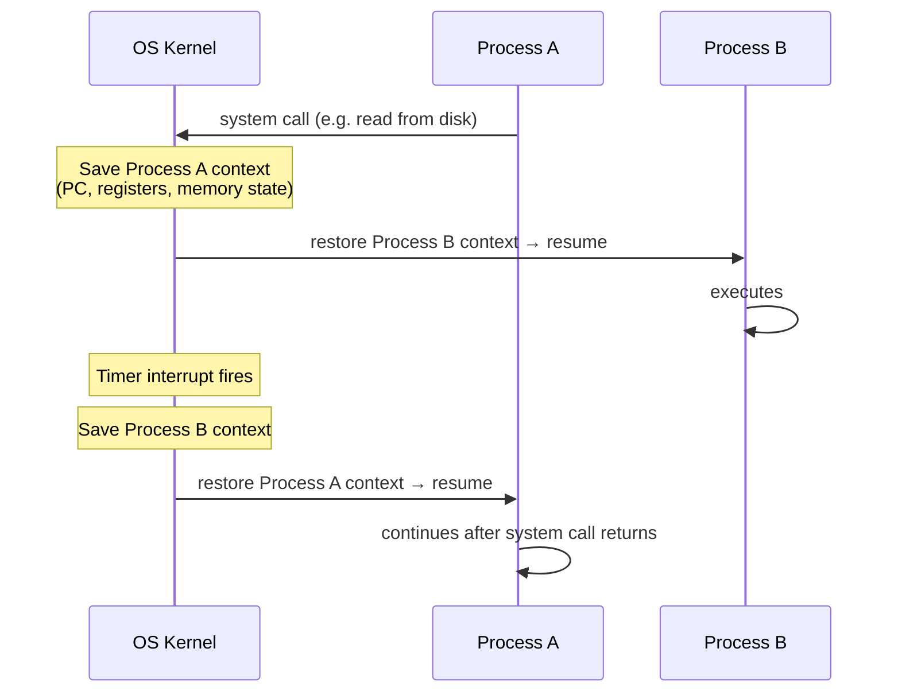

> **Source:** *Computer Systems: A Programmer's Perspective* (3rd ed.) by Randal E. Bryant and David R. O'Hallaron (Pearson, 2015), §1.7–1.9. These are personal study notes. All original content is copyright the authors and publisher.

---

## The OS as an intermediary

The operating system sits between application programs and the hardware. Two primary purposes:

1. **Protection** — prevent runaway or malicious applications from corrupting hardware or other applications
2. **Abstraction** — provide simple, uniform interfaces over complex, varied hardware

Three fundamental abstractions the OS provides:

| Abstraction | What it hides |
|-------------|---------------|
| **Files** | I/O devices |
| **Virtual memory** | Main memory + disk |
| **Processes** | Processor + memory + I/O devices |

---

## Processes and context switching

A **process** is the OS's abstraction for a running program. The key illusion it provides: the program thinks it has exclusive use of the CPU and memory.

In reality, multiple processes run concurrently by **context switching** — the OS rapidly interleaves them:



The **context** is the complete state needed to resume a process: the PC value, all register values, and the contents of main memory. Context switching is managed entirely by the OS kernel — it is invisible to the processes themselves.

---

## Threads

A process can have multiple **threads** of execution. Each thread runs in the context of the process and shares the same code, data, and heap, but has its own stack and register state.

Threads vs processes:

| | Process | Thread |
|-|---------|--------|
| Address space | Private | Shared within process |
| Creation cost | High (new address space) | Low |
| Context switch cost | High | Lower |
| Data sharing | Via IPC | Direct (same memory) |
| Risk | Crash is isolated | Crash can corrupt whole process |

Threads require synchronisation when accessing shared data — race conditions arise when two threads read and write the same memory without coordination.

---

## Virtual memory

Each process has the illusion of exclusive access to all of main memory. The OS and hardware (the MMU — memory management unit) translate **virtual addresses** to physical addresses on every access.

Virtual address space layout (low → high on Linux x86-64):

```
Address 0
  ┌───────────────────────────────────┐
  │  Program code and data            │  ← .text, .data, .rodata, .bss
  │                                   │    initialised from the executable
  ├───────────────────────────────────┤
  │  Heap  (grows upward ↑)           │  ← malloc / new
  │                                   │
  │  Stack (grows downward ↓)         │  ← local variables, return addresses
  ├───────────────────────────────────┤
  │  Shared libraries                 │  ← libc, runtime (memory-mapped)
  ├───────────────────────────────────┤
  │  Kernel virtual memory            │  ← inaccessible to user code
  └───────────────────────────────────┘
Address 2^48 (user-space limit on x86-64)
```

Stack overflows, null pointer dereferences, and segmentation faults all originate here — the process attempted to access a virtual address that isn't mapped to physical memory, and the OS kills it.

---

## Files

A **file** is a sequence of bytes. The OS models *every* I/O device as a file:

- Disk files are files
- The keyboard is a file (you `read()` from it)
- The display is a file (you `write()` to it)
- A network socket is a file (you `read()` and `write()` to it)

All I/O flows through two system calls: `read()` and `write()`. This uniform abstraction is why shell pipelines work — each process reads from `stdin` and writes to `stdout`, unaware of what's actually connected. From a system's perspective, a network connection is just another file descriptor.

---

## Amdahl's Law

Speeding up one part of a system is limited by how much time that part actually takes:

```
S_total = 1 / ((1 − α) + α/k)

where:
  α = fraction of total time taken by the part being improved
  k = speedup applied to that part
```

**Example:** a component takes 60% of total execution time; you make it 3× faster:
```
S = 1 / (0.4 + 0.6/3) = 1 / (0.4 + 0.2) = 1 / 0.6 ≈ 1.67×
```

Even making that component infinitely fast: `S = 1 / 0.4 = 2.5×`. The unimproved 40% sets the ceiling.

**Implication:** always profile before optimising. Optimising a path that takes 5% of runtime buys almost nothing.

---

## Concurrency vs parallelism

Two related but distinct concepts that are frequently conflated:

- **Concurrency**: multiple tasks are *in progress* at the same time (logically simultaneous — one CPU can be concurrent via time-sharing)
- **Parallelism**: multiple tasks *execute* at the same time (physically simultaneous — requires multiple cores or CPUs)

Three levels in modern systems:

| Level | Mechanism |
|-------|-----------|
| **Thread-level** | OS schedules threads across multiple cores |
| **Instruction-level** | CPU executes multiple instructions per cycle (pipelining, out-of-order execution) |
| **Data-level (SIMD)** | Single instruction operates on a vector of data values simultaneously |

---

## Key takeaways

- The OS provides three abstractions: **processes** (illusion of exclusive CPU + memory), **virtual memory** (illusion of exclusive address space), **files** (uniform interface over all I/O)
- Context switching is the OS saving one process's state and restoring another's — invisible to programs
- Threads share address space; processes do not. Thread sharing is efficient but requires synchronisation
- Stack overflows and segfaults are virtual-memory violations — the OS kills the offending process
- Every I/O device, including network sockets, is a file — `read()` and `write()` all the way down
- **Amdahl's Law**: overall speedup is bounded by the fraction you *didn't* improve — profile first
- **Concurrency ≠ parallelism**: one is about structure, the other about physical execution
