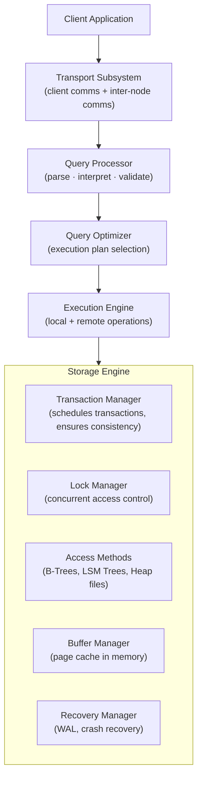

> **Source:** *Database Internals: A Deep Dive into How Distributed Data Systems Work* by Alex Petrov (O'Reilly, 2019), Chapter 1. These are personal study notes. All original content is copyright the author and publisher.

---

## The client/server model

Database management systems use a client/server model. Application instances are clients; database system instances (nodes) are servers. Client requests arrive through the **transport subsystem**, which also handles communication between nodes in a database cluster.

### Request flow

1. Transport subsystem receives the query and hands it to the **query processor**, which parses, interprets, and validates it.
2. The parsed query goes to the **query optimizer**, which selects the most efficient execution plan using internal statistics (index cardinality, approximate intersection sizes, etc.).
3. The **execution engine** executes the plan, collecting results of local and remote operations. Remote execution involves reading/writing data to other nodes and replication.
4. Local queries are executed by the **storage engine**.

### Storage engine components

| Component | Responsibility |
|-----------|---------------|
| **Transaction Manager** | Schedules transactions; ensures they cannot leave the database in a logically inconsistent state |
| **Lock Manager** | Controls locks on database objects to prevent concurrent operations from violating physical data integrity |
| **Access Methods** | Manage how data is organised and accessed on disk: heap files, B-Trees, LSM Trees |
| **Buffer Manager** | Caches data pages in memory (the buffer pool) |
| **Recovery Manager** | Maintains the operation log (WAL, Write-Ahead Log); restores system state after failures |

---

## In-memory vs disk-based storage

### Disk-based DBMS

Holds most data on disk; uses memory primarily for caching (the buffer pool) and temporary storage. The unit of I/O is a page (typically 4–16 KB). Hot pages stay in the buffer pool; cold pages are evicted to disk. A cache miss = a disk read, which costs microseconds to milliseconds.

### In-memory DBMS

Stores data primarily in RAM; uses disk only for durability (the write-ahead log and periodic snapshots). All access is in-memory, measured in nanoseconds.

**Advantages of in-memory:**
- Orders-of-magnitude faster access (nanoseconds vs microseconds)
- No page-granularity access overhead, can address at byte granularity
- Simpler data structures (no need to serialise to page format)

**Disadvantages of in-memory:**
- RAM is volatile, a crash without proper logging loses data
- More expensive per GB than disk
- Total dataset must fit in available RAM

### Durability in in-memory stores

Before any operation is considered complete, changes must be written to a **sequential log file** on disk. On recovery, the database replays the log from the last checkpoint to reconstruct the in-memory state.

---

## Key takeaways

- DBMS architecture follows client/server: transport → query processor → optimizer → execution engine → storage engine.
- The storage engine is the innermost layer and contains five sub-components: transaction manager, lock manager, access methods, buffer manager, and recovery manager.
- The buffer manager is the software equivalent of the hardware cache hierarchy, hot pages in RAM, cold pages on disk.
- In-memory databases trade volatile storage for speed; the WAL provides durability.
