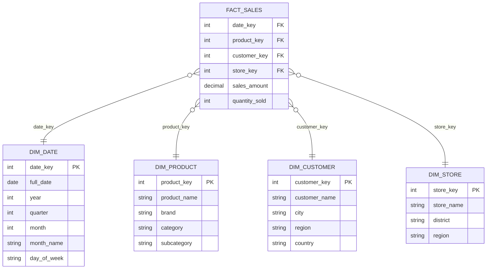
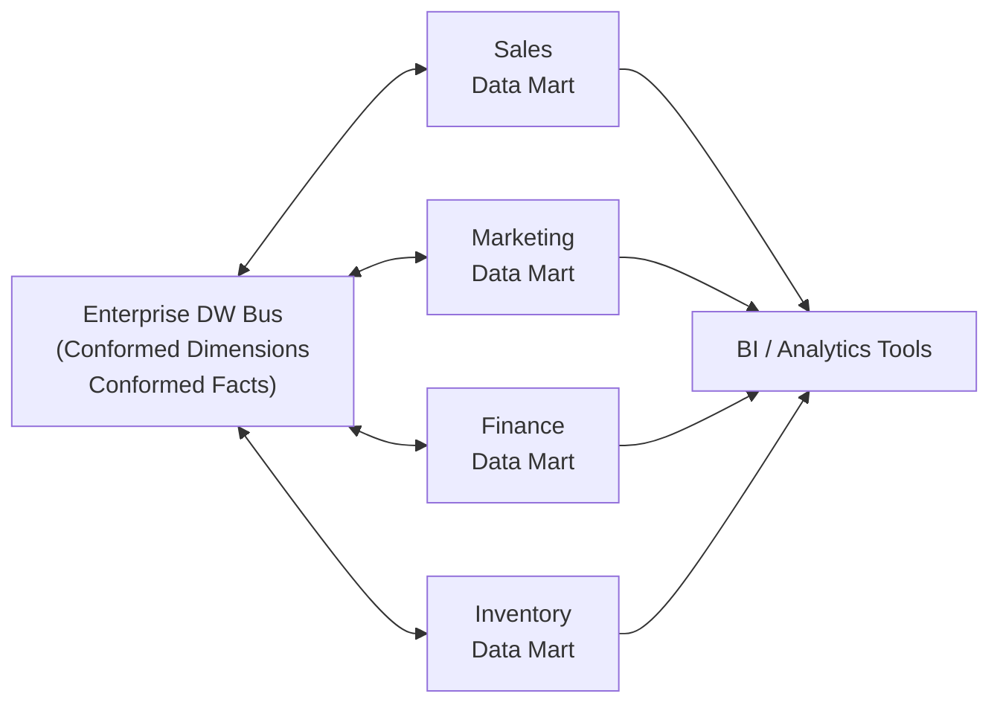

> **Source:** *The Data Warehouse Toolkit: The Definitive Guide to Dimensional Modeling* (3rd ed.) by Ralph Kimball and Margy Ross (Wiley, 2013), Chapters 2–3. These are personal study notes. All original content is copyright the authors and publisher.

---

## The four-step dimensional design process

Every dimensional model is produced by the same four steps, in order:

1. **Select the business process**: what operational activity generates the data? (e.g. processing an order, registering a student for a class)
2. **Declare the grain**: exactly what does one row in the fact table represent?
3. **Identify the dimensions**: what descriptive context surrounds each measurement event?
4. **Identify the facts**: what numeric measurements result from the event?

---

## Grain

Declaring the grain is the pivotal step. The grain establishes exactly what a single fact table row represents, and becomes a binding contract for the rest of the design. Every candidate dimension and fact must be consistent with the declared grain.

- **Atomic grain** refers to the lowest level at which data is captured by a given business process. Atomic grain gives the most flexibility for slicing and dicing.
- **Different grains must not be mixed in the same fact table.**

---

## Star schema

A **star schema** is a dimensional structure deployed in a relational database. A central fact table is linked to surrounding dimension tables via primary/foreign key relationships. The name comes from the shape: one centre, many points.

An **OLAP cube** is a dimensional structure implemented in a multi-dimensional database. It contains the same dimensional attributes and facts but is queried with languages like MDX and XMLA rather than SQL. OLAP cubes are often the final deployment step, derived from a more atomic relational star schema.

---

## Fact tables

A fact table contains the numeric measures from a business process event. At atomic grain, one fact table row = one measurement event.

**Three types of numeric measures:**

| Type | Description | Example |
|------|-------------|---------|
| **Additive** | Can be summed across all dimensions | Sales revenue |
| **Semi-additive** | Can be summed across some dimensions but not all | Account balance (not across time) |
| **Non-additive** | Cannot be summed across any dimension | Ratios, percentages |

For non-additive facts: store the fully additive components and compute the ratio in the BI layer or OLAP cube.

**Nulls in fact tables:** aggregate functions handle null facts correctly. Nulls in foreign key columns are forbidden, they would violate referential integrity.

**Three fact table patterns:**

| Pattern | Grain | Use case |
|---------|-------|---------|
| **Transaction** | One row per individual measurement event | Point-in-time transactions |
| **Periodic snapshot** | One row per period (day, week, month) | Recurring summaries; always dense |
| **Accumulating snapshot** | One row per pipeline instance, updated as it progresses | Order fulfillment, claim processing |

**Factless fact tables** record events with no numeric measurement, e.g. student attending class. Can be queried to analyse what *didn't* happen.

**Aggregate fact tables** are numeric roll-ups of atomic data, built solely to accelerate query performance. Should behave like database indexes, transparent to BI applications.

---

## Dimension tables

Dimension tables are usually wide, flat, denormalised tables with low-cardinality text attributes. They provide the descriptive context ("who, what, where, when, why") that surrounds each fact.

**Surrogate keys:** dimension tables use surrogate (system-generated) integer primary keys, not natural keys from operational systems. Natural keys change over time (employee IDs recycled, etc.); surrogate keys are stable.

**Natural, durable, and supernatural keys:**
- *Natural key*: the identifier from the source system
- *Durable key*: a stable identifier assigned by the data warehouse that never changes, even if the source system changes
- *Surrogate key*: the integer primary key assigned to each row, including each historical version

**Snowflaking:** normalising dimension attributes into sub-tables. Kimball strongly discourages this, as it creates complexity for users and query tools, and a flattened table contains exactly the same information.

**Other dimension patterns:**

| Pattern | Description |
|---------|-------------|
| **Role-playing dimension** | One physical dimension table referenced multiple times in a fact table (e.g. order date, ship date, delivery date all join to the same date dimension) |
| **Junk dimension** | Low-cardinality flags and indicators combined into a single dimension ("transaction profile") to avoid polluting the fact table |
| **Degenerate dimension** | A dimension key with no corresponding dimension table, e.g. an order number stored directly in the fact table |
| **Outrigger dimension** | A dimension that references another dimension table; used sparingly |
| **Calendar date dimension** | Present in virtually every model; pre-computed attributes like week number, fiscal quarter, holiday flag make SQL queries far simpler |

---

## Slowly changing dimensions (SCD)

Real-world dimension attributes change over time. Four standard approaches:

| Type | Technique | History preserved? | When to use |
|------|-----------|-------------------|-------------|
| **Type 0** | Retain original: attribute never changes | N/A | "Original credit score", date dimension attributes |
| **Type 1** | Overwrite: old value replaced with new | ✗ | Corrections; downstream aggregates must be recomputed |
| **Type 2** | Add new row: new surrogate key, row effective/expiration dates, current-row flag | ✓ full | The standard approach for tracking history |
| **Type 3** | Add new column: alternate reality; old value preserved as a separate attribute | Partial | Planned, organisation-wide attribute transitions |
| **Type 4** | Mini-dimension: rapidly changing attributes split off into a separate small dimension | ✓ | High-velocity attributes (e.g. income band, credit tier) |

Type 2 requires at minimum three additional columns: `row_effective_date`, `row_expiration_date`, `is_current_row`.

---

## Conformed dimensions and the EDW bus

### Conformed dimensions

Dimension tables **conform** when attributes in separate dimension tables have the same column names and domain contents. A conformed dimension is defined once and reused across multiple fact tables and subject areas.

**Why it matters:** when the same conformed attributes are used as row headers in separate queries against different fact tables, the results can be aligned in a single report, a technique called **drill-across**.

### Shrunken dimensions

A subset of rows and/or columns from a base dimension. Required when building aggregate fact tables, or when a business process captures data at a higher level of granularity than the base dimension.

### The EDW bus architecture

The bus architecture integrates an enterprise data warehouse from a collection of data marts. Each data mart is built around a specific business process, but all share the same conformed dimensions and facts, so data from any mart can be combined in a report.

---

## Graceful extensions

Dimensional models are designed to absorb change without breaking existing queries:

- Add new facts by adding new columns to an existing fact table
- Add new dimensions by adding new foreign key columns (provided they don't change the grain)
- Add new attributes to existing dimension tables
- Increase grain atomicity by adding attributes to a dimension and restating the fact table at the lower grain, preserving existing column names

---

## Key takeaways

- Four-step process: business process → grain → dimensions → facts. The grain is the binding contract.
- Star schema: one central fact table surrounded by dimension tables. Snowflaking creates complexity without adding information.
- Fact tables hold numeric measurements; dimension tables hold descriptive context.
- Additive facts can be summed everywhere; semi-additive only across some dimensions; non-additive not at all.
- Three fact table patterns: transaction, periodic snapshot, accumulating snapshot.
- Surrogate keys decouple the warehouse from source system volatility.
- SCD Type 2 (add new row) is the standard approach for tracking historical attribute changes.
- Conformed dimensions enable drill-across: combining results from separate fact tables in a single report.
