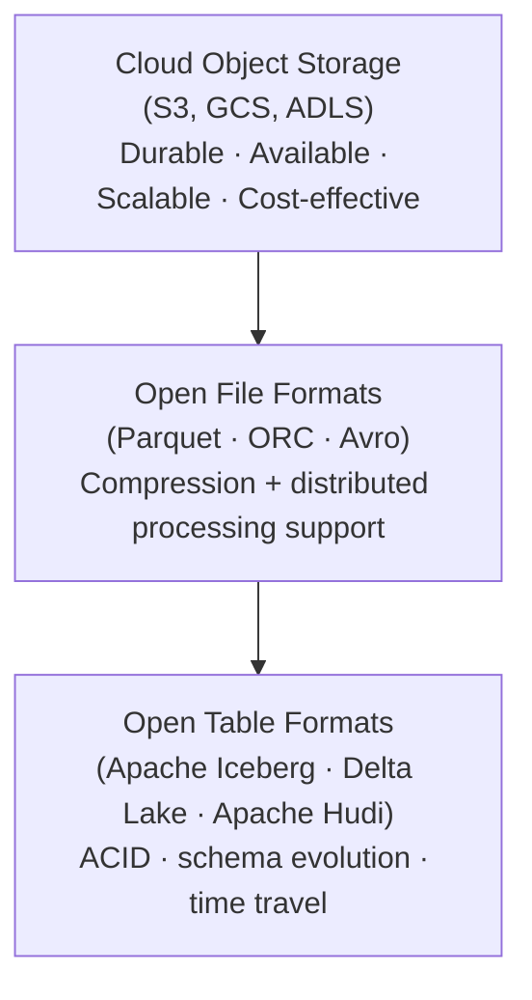
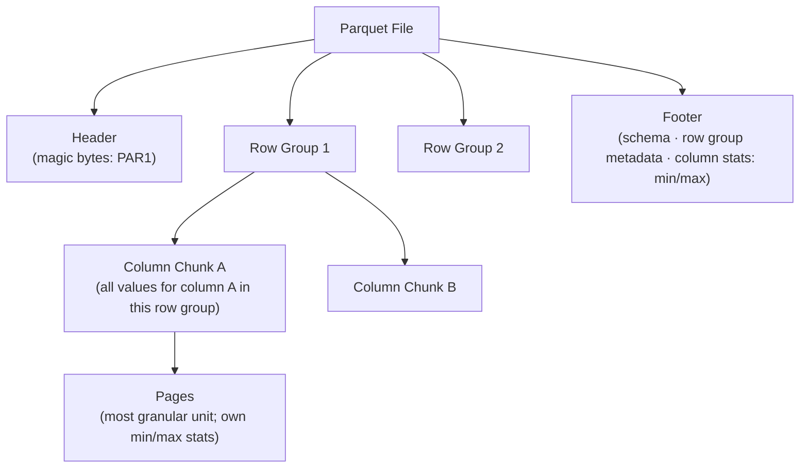
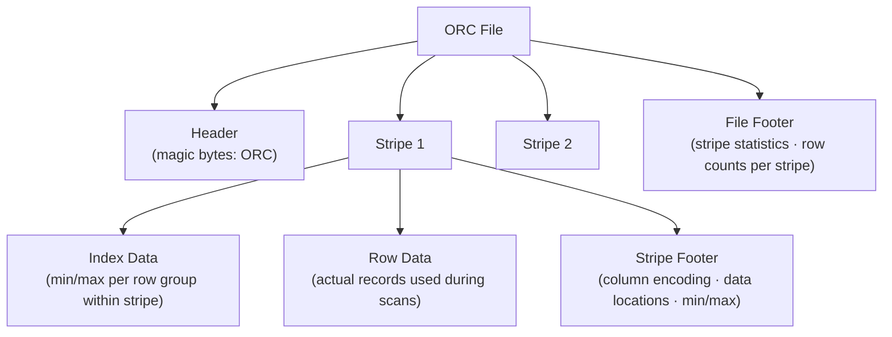
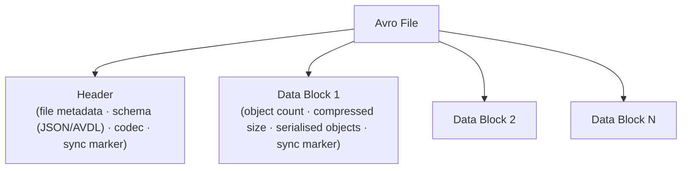
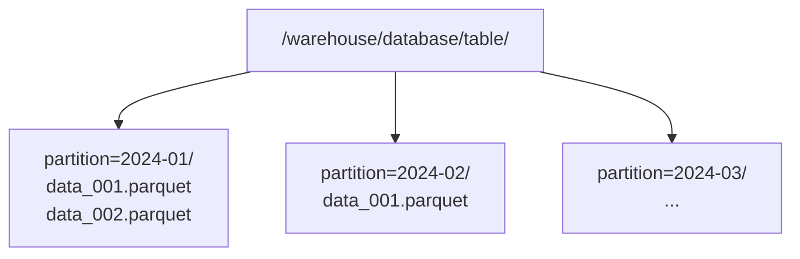

> **Source:** *Lakehouse Essentials* (O'Reilly Learning), Unit 2. These are personal study notes. All original content is copyright the author and publisher.

---

## Storage as a performance layer

Lakehouse storage is not just about persisting data. The storage layer directly enables query engines to retrieve results faster by reducing the data that must be scanned.

Three techniques for minimising data scanned:

1. **Partition or file pruning** — eliminating entire partitions or files from a query based on partition metadata
2. **Indexing and clustering** — organising data so exact records can be located without a full table scan
3. **Column-level statistics** — maintaining min/max values per column so data blocks outside the query range can be skipped

Always aim to fetch only what's needed: select only required columns, partition or cluster tables on common filter attributes, and keep column statistics up to date.

---

## Lakehouse storage components

A lakehouse storage tier has three layers:

Traditional file formats (CSV, JSON, plain text) have fundamental limitations for analytics: poor compression ratios, no built-in schema, no data skipping, not splittable in compressed form. The open columnar formats were designed to solve these.

---

## Parquet

An open-source **columnar** file format. Provides significantly better compression ratios than row-based formats and is optimised for analytical queries that touch only a subset of columns.

**Structure:** the file contains a header, one or more row groups, and a footer. Each row group holds all the values for each column as a column chunk. Column chunks are subdivided into pages — the most granular addressable unit.

**Key properties:**
- **Columnar storage** — queries touching only a few columns skip all other column data
- **Encoding** — values within a column tend to be similar, so columnar encoding achieves higher compression ratios than row-based encoding
- **Footer metadata** — schema, row group info, and per-column min/max statistics enable both schema inference and data skipping
- **Splittable** — supports distributed processing with Spark; each row group can be assigned to a separate task

---

## ORC

**Optimised Row Columnar** — the successor to Hive's RCFile format. Provides ACID support, built-in indexes, and supports complex types (structs, lists, maps).

**Structure:** the file is divided into stripes (analogous to Parquet's row groups). Each stripe contains index data, row data, and a stripe footer. The file footer holds stripe-level statistics.

**Key properties:**
- **Deep Hive integration** — originally created as Hive's primary storage format for Hadoop
- **ACID support** — the only open file format that enables Hive's ACID transactional processing
- **Built-in indexes** — min/max indexes per row group within each stripe enable data skipping without a separate index structure

---

## Avro

An open-source **row-based** serialisation format. Unlike Parquet and ORC, Avro is optimised for write throughput and schema evolution rather than analytical reads.

**Structure:** a header followed by one or more data blocks. The header stores the full schema as JSON (or Avro IDL), making it self-describing. Each data block is independently compressed and terminated with the file's 16-byte sync marker (enabling reliable splitting).

**Key properties:**
- **Self-describing** — schema is embedded in the file; readers can always interpret the data
- **Schema evolution** — fields can be added, removed, or given defaults; Avro defines precise compatibility rules
- **Splittable in compressed form** — the sync marker enables splitting even after compression, enabling distributed reads
- **Row-based** — best suited for ETL pipelines and event streaming, not column-scan analytics
- **Multi-language** — supported natively in Java, C, C++, C#, Python

**Best used for:** ETL pipelines, event streaming (Kafka schema registry uses Avro), workloads with frequent schema changes.

---

## File format comparison

| | Parquet | ORC | Avro |
|-|---------|-----|------|
| Storage model | Columnar | Columnar | Row-based |
| Best for | Analytical reads | Hive + analytics + ACID | ETL / streaming / schema evolution |
| Compression | High (columnar encoding) | High (columnar encoding) | Moderate |
| ACID support | No (needs table format) | Yes (with Hive) | No |
| Schema evolution | Limited | Limited | Excellent |
| Splittable compressed | Yes | Yes | Yes |

---

## Table formats

A **table format** organises data files into a logical table. It stores metadata about each file: schema, creation/update time, record counts, record-level operation types (insert, update, delete). Table formats give data lakes ACID features, support for updates and deletes, and data-skipping capabilities.

### Hive

The original data lake table format, built for Hadoop/HDFS. Organises data as a directory tree:

**Hive strengths:** partitioning, supports multiple file formats (CSV, JSON, Parquet, ORC, Avro), engine-agnostic (Hive, Spark, Presto can all read the same table).

**Hive limitations:**
- **No ACID out of the box** — data within a partition is immutable; updates require full partition rewrites
- **Limited performance** — no snapshots means query planning requires full partition listing
- **No updates or deletes** — only insert-overwrite at partition granularity

These limitations drove the development of modern open table formats.

### Modern open table formats (Apache Iceberg, Delta Lake, Apache Hudi)

Modern table formats layer metadata on top of the file layer to provide:

- **ACID transactions** — commit-based writes; readers see consistent snapshots
- **Time travel** — query any past snapshot by timestamp or snapshot ID
- **Schema evolution** — add, rename, or drop columns safely
- **Partition evolution** — change partitioning strategy without rewriting data
- **Data skipping** — per-file statistics in the metadata layer enable skipping files that cannot contain query results

---

## Key takeaways

- Lakehouse storage = cloud object storage + open file formats + open table formats.
- Three query-performance tools: partition pruning, clustering/indexing, column statistics.
- **Parquet**: columnar, high compression, schema in footer, best for analytical reads.
- **ORC**: columnar, deep Hive integration, ACID support, built-in indexes.
- **Avro**: row-based, self-describing, excellent schema evolution, best for ETL and streaming.
- **Hive**: the original table format — simple directory partitioning, no ACID, no updates.
- Modern table formats (Iceberg, Delta Lake, Hudi) add ACID, time travel, schema/partition evolution, and data skipping on top of the file layer.
