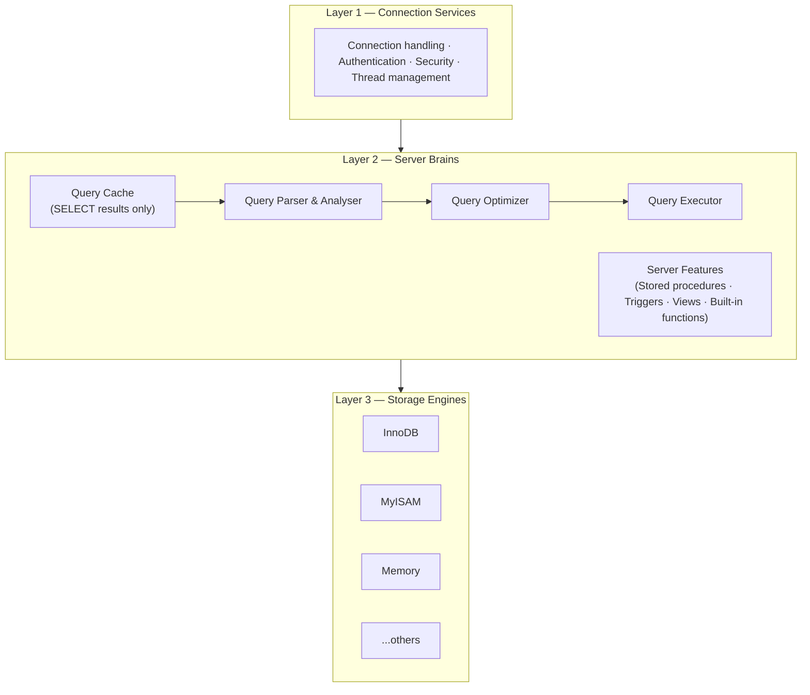
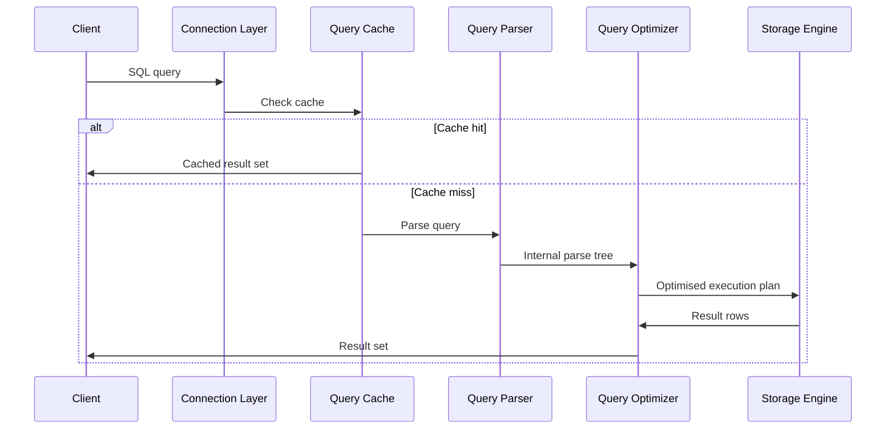

> **Source:** *High Performance MySQL* (O'Reilly), Unit 1 — MySQL Architecture and History. These are personal study notes. All original content is copyright the authors and publisher.

---

## Three-layer architecture

MySQL's architecture has three distinct layers:

### Layer 1: Connection services

The topmost layer handles concerns common to all network-based client/server tools: connection handling, authentication, and security. Each client connection gets its own thread. The server caches threads so they don't need to be created and destroyed for each new connection.

### Layer 2: Server brains

This is where most of MySQL's intelligence lives. Key responsibilities:

- **Query cache**: stores the result sets of `SELECT` statements. If an identical query arrives and the underlying data hasn't changed, the cached result is returned directly, bypassing parsing and optimisation entirely. (Deprecated and removed in MySQL 8.0 due to locking overhead.)
- **Query parser and analyser**: parses the query into an internal structure; validates syntax and semantics
- **Query optimizer**: transforms the parsed query into an efficient execution plan. The optimizer does not care which storage engine is used, but the storage engine *does* influence the optimizer's choices (available indexes, storage characteristics, etc.)
- **Built-in functions, stored procedures, triggers, views**: all live at this layer; any functionality that spans storage engines is implemented here

### Layer 3: Storage engines

Responsible for storing and retrieving all data. The server communicates with storage engines through a **storage engine API**, a low-level interface that abstracts differences between engines with operations like "begin a transaction" or "fetch the row with this primary key". **Storage engines do not parse SQL.** They respond to API requests from the server.

Each engine has different strengths:

| Engine | Strengths | Notes |
|--------|-----------|-------|
| **InnoDB** | ACID transactions, row-level locking, foreign keys, crash recovery | Default since MySQL 5.5 |
| **MyISAM** | Fast reads, full-text search | No transactions, table-level locking |
| **Memory** | Extremely fast in-memory access | Data lost on restart |

---

## Query execution flow

---

## Key takeaways

- MySQL has three layers: connection services, server brains (parser/optimizer/executor), and pluggable storage engines.
- The storage engine API decouples query execution from storage, engines respond to API calls, not SQL.
- The optimizer selects the execution plan but the storage engine influences the optimizer's choices (index availability, etc.).
- InnoDB is the default and only engine that supports full ACID transactions with row-level locking.
- The query cache (pre-8.0) short-circuits the entire parse/optimise pipeline on identical queries, but at the cost of heavyweight invalidation on writes.
