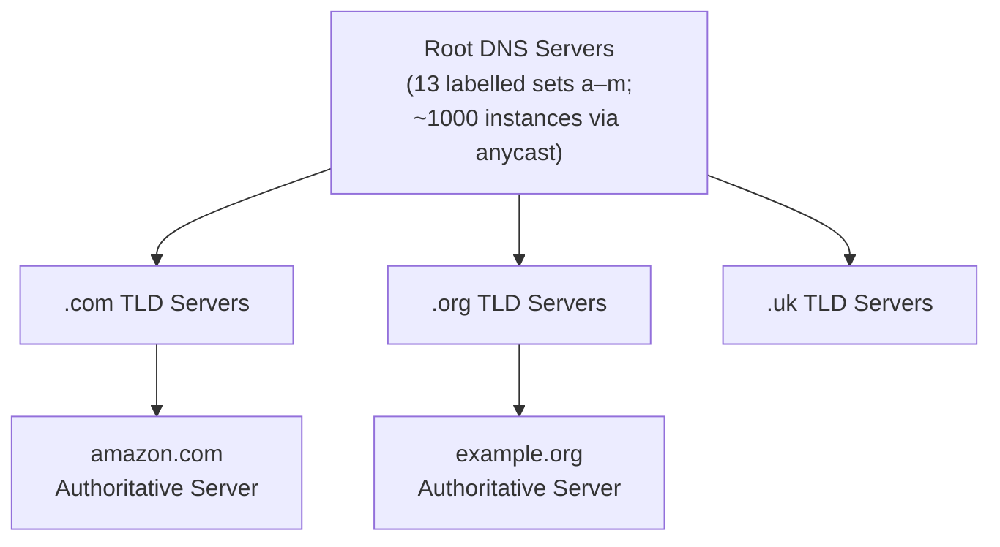
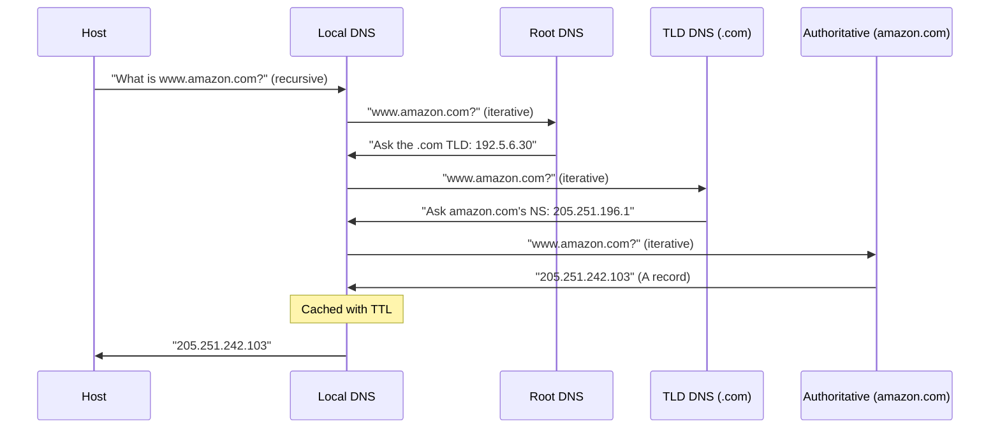

> **Source:** *Computer Networking: A Top-Down Approach* (8th ed.) by James F. Kurose and Keith W. Ross (Pearson, 2021), §2.4. These are personal study notes. All original content is copyright the authors and publisher.

---

## What DNS does

The **Domain Name System** translates human-readable hostnames (`www.amazon.com`) to IP addresses (`205.251.242.103`). It also handles:

- **Mail server aliasing**: `MX` records map a domain to its mail server's canonical hostname
- **Load distribution**: one hostname mapped to multiple IP addresses; DNS rotates which it returns
- **Host aliasing**: canonical hostnames with shorter aliases

DNS is a **distributed, hierarchical database** implemented as an application-layer protocol. A single centralised DNS server would be a single point of failure, a traffic bottleneck, and geographically distant from most users.

---

## The three-tier hierarchy

- **Root servers**: the top of the hierarchy; know the IP addresses of all TLD servers
- **TLD servers**: one set per top-level domain (`.com`, `.org`, `.net`, `.uk`, etc.); know the authoritative servers for every domain under them
- **Authoritative servers**: maintained by organisations; hold the actual A/AAAA records for their own hostnames

**Local DNS server**: not in the hierarchy, but used first. Every ISP runs one. Acts as a proxy, caches results, and forwards queries into the hierarchy on behalf of clients.

---

## Iterative vs recursive resolution

**Recursive query:** each server takes full responsibility for resolving the name and returns the final answer. In practice, only the query from client to local DNS is recursive, as root and TLD servers don't want to be burdened with full recursive lookups.

**Iterative query:** the local DNS server does the leg work. Root gives a referral, TLD gives a referral, authoritative gives the answer.

---

## DNS caching

Any DNS server caches responses it receives. The cached mapping expires after its **TTL** (time-to-live), set by the authoritative server. TLD records are commonly cached in local DNS servers, so root servers are rarely queried in practice.

This is why DNS propagation takes up to 48 hours when you change a record, as every resolver that cached the old mapping must wait for its TTL to expire before querying again.

---

## Resource records

DNS databases store **Resource Records (RRs)** with the structure: `(Name, Value, Type, TTL)`.

| Type | Name | Value | Use |
|------|------|-------|-----|
| **A** | hostname | IPv4 address | The core mapping: hostname → IP |
| **AAAA** | hostname | IPv6 address | Same, for IPv6 |
| **NS** | domain | hostname of authoritative DNS server | "Who answers for this domain?" |
| **CNAME** | alias | canonical hostname | Aliasing: `www` → `server1.example.com` |
| **MX** | domain | canonical hostname of mail server | Mail routing |

If a server is authoritative for a hostname, it has an **A record**. If not authoritative, it has an **NS record** pointing to the authoritative server, plus an **A record** for that server (a "glue record", to avoid a circular lookup).

---

## DNS message format

Both queries and replies use the same message format. A 12-byte fixed header includes flags (query/reply, authoritative answer, recursion desired, recursion available) and counts for four variable-length sections: questions, answers, authority, additional.

DNS uses **UDP** on port 53 for most queries, as it's fast, low overhead, and queries fit in a single packet. Switches to TCP for responses larger than 512 bytes (e.g. zone transfers).

---

## Key takeaways

- DNS is a distributed hierarchical database: Root → TLD → Authoritative.
- Local DNS server proxies queries on behalf of clients and caches results.
- Iterative resolution: the local DNS server does the leg work, not the root/TLD servers.
- DNS caching + TTL keeps load manageable; propagation delay = old TTLs expiring across the world's resolvers.
- A records map hostname → IPv4. NS records delegate a domain to an authoritative server.
- DNS uses UDP port 53 for queries; TCP for large responses.
