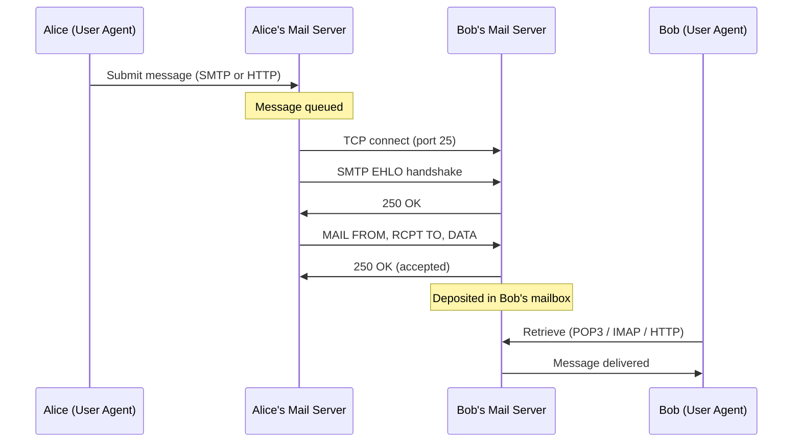
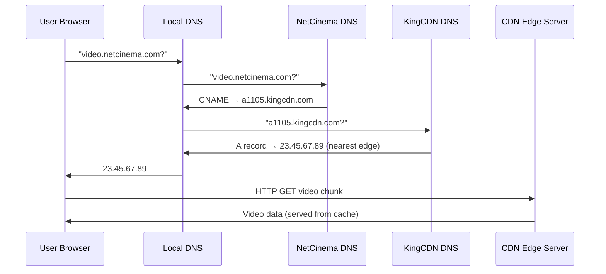

> **Source:** *Computer Networking: A Top-Down Approach* (8th ed.) by James F. Kurose and Keith W. Ross (Pearson, 2021), §2.3, §2.5–2.6. These are personal study notes. All original content is copyright the authors and publisher.

---

## Electronic mail

Three major components: **user agents** (Outlook, Gmail), **mail servers**, and **SMTP**.

### SMTP

**Simple Mail Transfer Protocol** is the application-layer protocol for sending email between mail servers. It uses TCP on port 25 and is ASCII-based, so humans can read the exchanges on the wire.

SMTP is a **push** protocol: the sending server pushes to the receiving server. A key restriction: SMTP requires message bodies to be 7-bit ASCII. Binary attachments must be encoded (MIME base64) first.

**SMTP vs HTTP:**

| | HTTP | SMTP |
|-|------|------|
| Direction | Pull (client requests) | Push (sender delivers) |
| Encoding | Binary-safe | 7-bit ASCII only |
| Objects | Each object in its own response | All objects in one multipart message |
| Both | Persistent connections, ASCII command/response |

### Mail access protocols

SMTP moves mail *between* servers. To retrieve mail *from* a server to a local client, a separate protocol is needed:

- **POP3** (Post Office Protocol v3): simple, three phases: authorisation, transaction (list/download/delete), update. Default behaviour is download-and-delete, so reading from multiple devices is awkward. Stateless across sessions.
- **IMAP** (Internet Message Access Protocol): keeps all messages on the server; the user organises into folders on the server side. Maintains state across sessions. Supports partial message retrieval (headers only). Better for multi-device access.
- **HTTP**: web-based email (Gmail) uses HTTP between the browser and the mail server. SMTP still runs between mail servers.

---

## P2P file distribution: BitTorrent

The canonical peer-to-peer file sharing protocol.

- A **torrent** is the collection of all peers sharing a particular file
- A **tracker** is a server that maintains a list of peers in the torrent
- The file is divided into **chunks** (~256 KB each)

**Joining:** a new peer registers with the tracker, receives a list of peers, and opens TCP connections with a subset (its neighbours). Periodically it asks each neighbour for a list of chunks they have.

**Rarest-first:** the peer requests the rarest chunks (those fewest neighbours have) first. This ensures rare chunks propagate quickly through the torrent.

**Tit-for-tat trading:** Alice sends chunks to the four neighbours currently uploading to her at the highest rate (the "unchoked" peers). Every 30 seconds she picks a random additional peer to upload to (optimistic unchoking), giving new peers a chance to get started. Peers that don't upload get choked and their upload is stopped. This creates an incentive to contribute.

BitTorrent is self-scaling: each new peer brings capacity (it uploads to others) as well as demand.

---

## Video streaming and CDNs

### Adaptive streaming (DASH)

**Dynamic Adaptive Streaming over HTTP** is the dominant approach for streaming video.

- Video is encoded at multiple bitrates and stored on HTTP servers
- A **manifest file** lists the available versions and their URLs
- The client requests chunks sequentially. Before each chunk, it measures available bandwidth and picks the highest bitrate version that fits, adapting on the fly
- Uses plain HTTP/TCP, no custom streaming protocol, works through firewalls and NATs
- The client controls quality selection, not the server

### Content Delivery Networks (CDNs)

A **CDN** is a geographically distributed network of servers that cache content close to end users. CDN providers (Akamai, Cloudflare, AWS CloudFront) lease server capacity at hundreds or thousands of locations.

Two placement strategies:

- **Enter Deep**: deploy clusters in access ISPs close to users. Low RTT, very high maintenance cost (Akamai's approach: thousands of locations).
- **Bring Home**: fewer, larger clusters at IXPs (Internet Exchange Points). Easier to manage, slightly higher RTT.

**How a CDN request is routed:**

DNS is the routing mechanism. When a user requests `video.netcinema.com`, NetCinema's DNS returns a CNAME pointing to a CDN hostname. The CDN's own DNS then returns the IP of a nearby cluster (selected by geo-IP, RTT probing, or load). The browser fetches from that cluster transparently.

**OTT (Over The Top)**: delivering content over the existing Internet without special network support. DASH + CDN is the OTT approach.

---

## Key takeaways

- SMTP pushes mail between servers over TCP port 25; POP3/IMAP let clients pull from their mailbox.
- SMTP is ASCII-only; binary attachments need MIME encoding.
- BitTorrent uses **rarest-first** to distribute rare chunks quickly and **tit-for-tat** to incentivise uploading.
- DASH gives clients adaptive quality control over HTTP — no special streaming protocol needed.
- CDNs route requests to nearby clusters via DNS CNAMEs, reducing latency and origin-server load.
