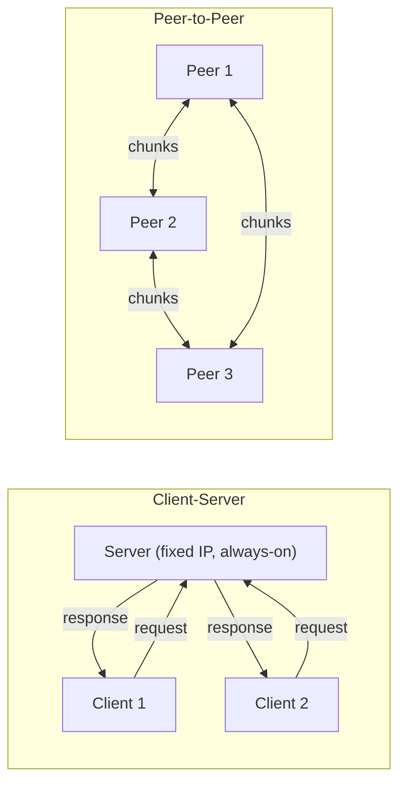
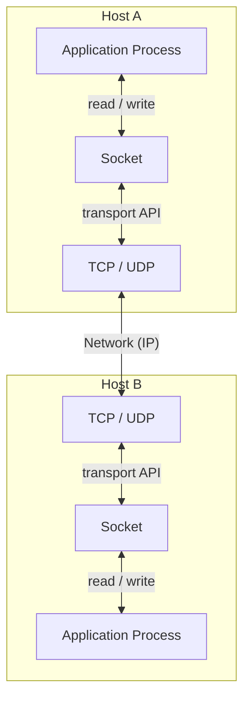
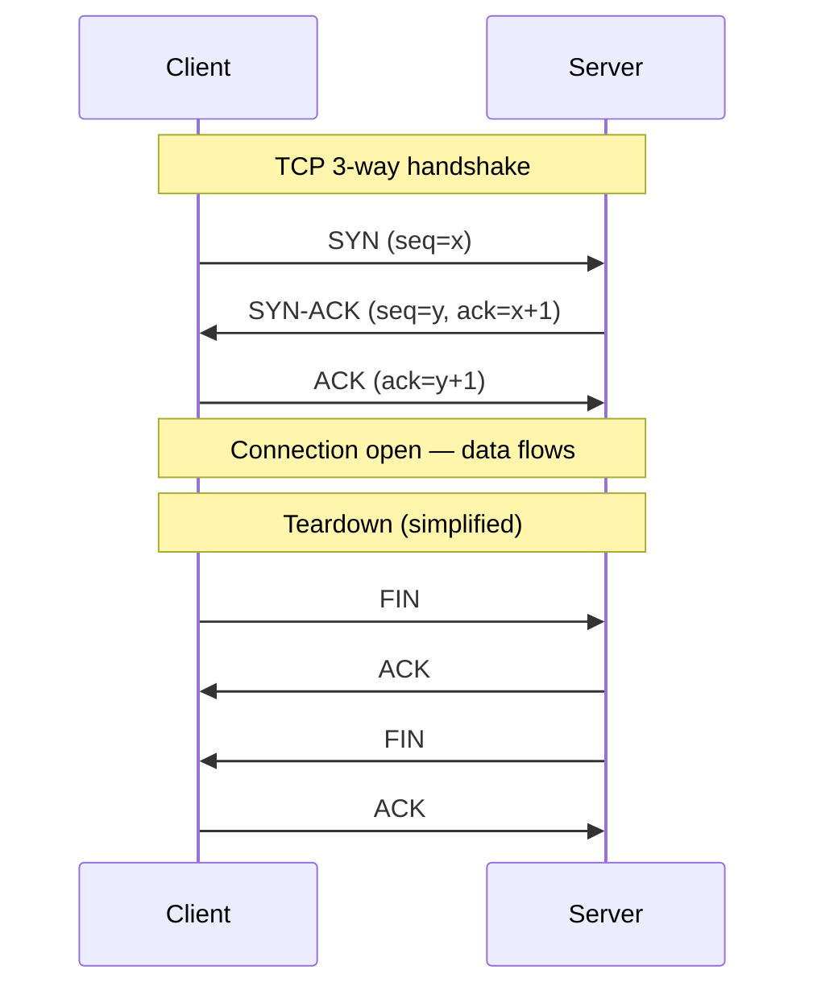
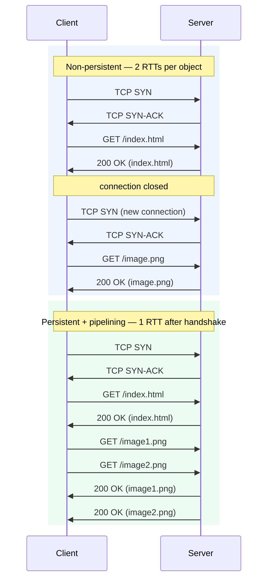

> **Source:** *Computer Networking: A Top-Down Approach* (8th ed.) by James F. Kurose and Keith W. Ross (Pearson, 2021), §2.1–2.2. These are personal study notes. All original content is copyright the authors and publisher.

---

## Application architectures

Network applications run on end systems (hosts), not on routers or switches. Two dominant paradigms:

- **Client-server**: always-on server with a fixed, well-known IP address; clients initiate contact. Clients don't talk directly to each other. Examples: Web, email, FTP. Servers live in data centres for scale.
- **Peer-to-peer (P2P)**: no always-on server; arbitrary end systems (peers) talk directly to each other. Self-scaling: each new peer adds capacity as well as load. BitTorrent is the canonical example.



---

## Sockets

A **process** is a running program. Two processes on different hosts communicate by sending messages across the network. The process sends and receives through its **socket**, the interface between the application layer and the transport layer.



To receive messages, a process needs an address: the **IP address** of the host plus a **port number** identifying the process. Well-known ports: HTTP 80, HTTPS 443, SMTP 25, DNS 53.

---

## TCP vs UDP

**TCP** provides reliable delivery, in-order bytes, flow control (won't overwhelm the receiver), and congestion control (backs off when the network is congested). It's connection-oriented: a three-way handshake before data flows.

**UDP** is connectionless, unreliable, no ordering guarantee, no congestion control. Lighter and faster, useful when dropping a packet is preferable to waiting for a retransmit (VoIP, live video, DNS).

Neither provides encryption natively. **TLS** is built on top of TCP, adding encryption, integrity, and endpoint authentication.



---

## HTTP

The **HyperText Transfer Protocol** is the Web's application-layer protocol. It runs over TCP.

**Stateless**: the server stores no state about the client between requests. If a client requests the same object twice, the server re-serves it with no memory of the first request. This simplifies server design enormously; cookies solve the statelessness at the application layer when needed.

### Persistent vs non-persistent connections

**Non-persistent (HTTP/1.0):** one TCP connection per object. Cost per object: **2 RTTs + transmission time** (1 RTT for TCP handshake, 1 RTT for the HTTP request and first byte of response).

**Persistent (HTTP/1.1 default):** the server leaves the TCP connection open after responding. With pipelining, the client sends all requests back-to-back and responses stream back, roughly 1 RTT for the whole page after the initial handshake.



### Request format

```
GET /somedir/page.html HTTP/1.1\r\n
Host: www.example.com\r\n
Connection: close\r\n
User-Agent: Mozilla/5.0\r\n
\r\n
```

Structure: **request line** (method + URL + version) + **header lines** + **blank line** (`\r\n`) + optional **body**.

The blank line is mandatory and signals end of headers. A missing `\r\n` silently breaks parsing, the server won't know where headers end.

**Methods:** `GET` (retrieve, no body), `POST` (submit data in body), `HEAD` (headers only, no body), `PUT` (upload), `DELETE`.

### Response format

```
HTTP/1.1 200 OK\r\n
Content-Length: 6821\r\n
Content-Type: text/html\r\n
\r\n
<html>...</html>
```

**Common status codes:**

| Code | Meaning |
|------|---------|
| 200 OK | Success, object in body |
| 301 Moved Permanently | Redirect; new URL in `Location:` header |
| 304 Not Modified | Conditional GET: object unchanged, no body sent |
| 400 Bad Request | Server couldn't parse the request |
| 404 Not Found | Object doesn't exist |
| 505 HTTP Version Not Supported | |

---

## Cookies

HTTP is stateless, but websites want to identify users. Cookies use four components:

1. `Set-Cookie:` header in an HTTP response
2. `Cookie:` header in subsequent HTTP requests
3. A cookie file on the user's machine, managed by the browser
4. A back-end database at the website

On first visit, the server creates a unique ID, stores it in its database, and sends `Set-Cookie: 1678` in the response. The browser appends `Cookie: 1678` to every subsequent request to that site. The server looks up 1678 and knows it's you.

---

## Web caches (proxy servers)

A **web cache** has its own disk storage and sits between clients and origin servers. Browsers are configured to send all requests through it. If the cache has a fresh copy, it returns it directly; otherwise it fetches from origin, stores a copy, and forwards it.

Benefits: lower response time for clients (cache is closer), reduced traffic on the access link. CDNs are geographically distributed networks of web caches.

**Conditional GET:** the cache includes `If-Modified-Since: <date>` in its request to origin. If the object hasn't changed, the server returns `304 Not Modified` with no body, saving bandwidth. If it has changed, `200 OK` with the new object.

---

## Key takeaways

- HTTP is stateless, ASCII-based, runs over TCP.
- The blank line (`\r\n`) separating headers from body is mandatory, and missing it silently breaks parsing.
- Persistent connections + pipelining reduce page load time to roughly 1 RTT after the TCP handshake.
- Cookies add a layer of state on top of the stateless protocol.
- Web caches reduce latency and access-link traffic; conditional GET (`304 Not Modified`) avoids re-fetching unchanged objects.
