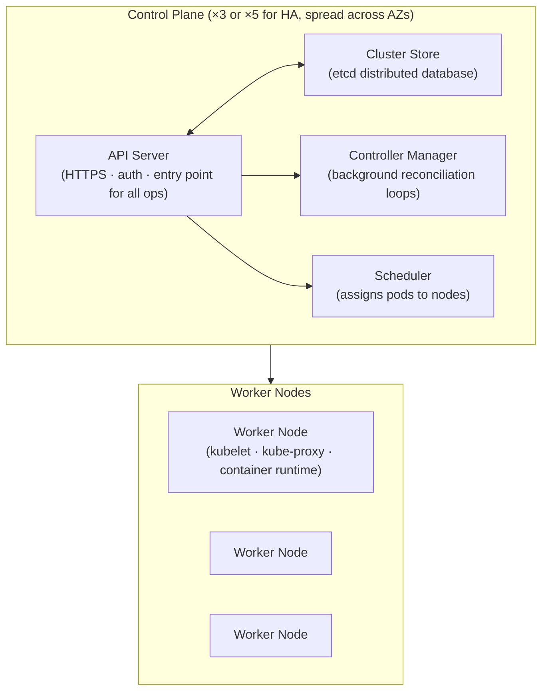

> **Source:** *Kubernetes Deep Dive* by Nigel Poulton, Section 1 — Kubernetes Principles of Operation. These are personal study notes. All original content is copyright the author and publisher.

---

## Cluster structure

A Kubernetes cluster consists of **control plane nodes** and **worker nodes**.

- Control plane nodes must run Linux
- Worker nodes can run Linux or Windows (a single cluster can mix both)
- Production clusters run three or five control plane nodes, spread across availability zones for high availability

---

## The control plane

The control plane is a collection of system services that implement the brains of Kubernetes. It:
- Exposes the API
- Schedules workloads to nodes
- Implements self-healing
- Manages scaling operations

Most clusters run every control plane service on every control plane node for HA.

### API Server

The **front end of Kubernetes**. All requests to change or query cluster state go through it — even internal control-plane services communicate via the API server rather than directly.

It exposes a RESTful API over HTTPS. All requests are subject to authentication and authorisation.

**Deploying or updating an application:**
1. Describe requirements in a YAML manifest
2. Post the manifest to the API server (`kubectl apply -f ...`)
3. Request is authenticated and authorised
4. Desired state is persisted to the cluster store
5. The scheduler and controllers act on the new desired state

### Cluster Store (etcd)

The **only stateful part of the control plane**. Holds the desired state of all applications and cluster components.

Based on **etcd** — a strongly consistent, distributed key-value store. Most clusters run an etcd replica on every control plane node. Large clusters with high change rates may run a dedicated etcd cluster for better performance.

Key property: etcd uses the Raft consensus algorithm to ensure that all replicas agree on the current state even in the presence of node failures. This is what gives Kubernetes its "source of truth" semantics.

### Controller Manager

Runs a collection of background **controller loops** — each watching the API server for changes and taking action to move actual state toward desired state.

Examples:
- *ReplicaSet controller* — if a pod dies, creates a replacement to maintain the desired replica count
- *Deployment controller* — manages rolling updates
- *Node controller* — monitors node health; marks unreachable nodes as unavailable

Each controller follows the same loop: observe current state → compare to desired state → take action to reconcile.

### Scheduler

Watches for newly created pods that have no node assigned, then selects an appropriate worker node based on:
- Available resources (CPU, memory)
- Node labels and pod node selectors/affinities
- Taints and tolerations
- Policy constraints

The scheduler only makes the assignment decision. The actual work of starting the container is done by the kubelet on the selected node.

---

## Worker nodes

Worker nodes are where application workloads run. Each node runs three components:

| Component | Role |
|-----------|------|
| **kubelet** | The node agent. Watches the API server for pods assigned to this node; instructs the container runtime to start/stop containers; reports node and pod status back to the API server |
| **kube-proxy** | Maintains network rules on the node; implements the Service abstraction (load balancing across pod replicas) |
| **Container runtime** | The software that actually runs containers. Historically Docker; modern clusters use containerd or CRI-O via the Container Runtime Interface (CRI) |

---

## The declarative model

Kubernetes is built around a **declarative model**: you describe *what you want*, not *how to achieve it*.

1. Declare desired state in a YAML manifest and post it to the API server
2. Kubernetes persists that desired state in etcd
3. Controllers continuously reconcile actual state toward desired state
4. If a pod crashes, a controller detects the discrepancy and creates a replacement — no manual intervention required

This is fundamentally different from the imperative model ("run this container on that server") — it enables self-healing, scaling, and rollouts as first-class features of the platform.

---

## Key takeaways

- A cluster has control plane nodes (brains) and worker nodes (where workloads run).
- The **API server** is the single entry point for all cluster operations — nothing talks to etcd directly except the API server.
- The **cluster store** (etcd) is the only stateful part of the control plane; everything else is stateless and can be restarted freely.
- The **controller manager** runs reconciliation loops that continuously drive actual state toward desired state — the mechanism behind self-healing.
- The **scheduler** assigns pods to nodes; the **kubelet** on each node carries out the instructions.
- Kubernetes is declarative: describe what you want, and the platform figures out how to achieve and maintain it.
