## Motivation

For those who know me closely, in about a month's time I am about to start a role as a Backend Engineer on Spotify's Data Platform team. To those who currently work with me, they have a tendency to see me as some technical paragon who knows all the low-level details of computing in a way that makes this transition completely sensible. But as every engineer knows, there's always another level to this game.

A couple of questions came up during the interview that had me rethinking my understanding of typing. Typing has always been something I never thought about too closely, it was something to keep in mind to make sure my code would compile (if it even needed to be compiled at all). So the first question, what's the difference between static and dynamic typing, was easy enough I thought: some languages need the types declared at compile time, others figure it out (or at least try to) during runtime. Easy.

The second question brought an interesting back and forth, and inspired the deep dive I'm writing about today. "What's the difference between strongly and weakly typed languages?" I had to be honest. As a data engineer I've only ever worked with strongly typed languages, so I had completely forgotten the answer to this and didn't try to hide it. I told them I didn't know.

> **Strongly vs weakly typed:** Strongly typed languages enforce type boundaries and raise errors when types are mixed without an explicit conversion. Weakly typed languages silently coerce values to make operations work, often inconsistently depending on the operator.

Straightforward enough. But where does Java's autoboxing fit in? I asked back.

> **Java autoboxing:** Java automatically converts between primitive types like `int` and their object wrappers like `Integer` without you writing the conversion, which looks exactly like the kind of silent type coercion you'd call weak typing. But it is actually a fully type-safe transformation the compiler inserts with complete knowledge of what it's doing, not a runtime guess. It blurs the line between "the compiler did something you didn't ask for" and "the language let something unsafe happen."

Nobody on that call really knew, so I took it on myself in this weird limbo period before starting to actually understand how typing truly works under the hood and get to the bottom of this question.

---

## The CPU has no idea what a type is

RAM is just a sequence of bytes. Each byte holds a number from 0 to 255. No labels, no metadata, no annotations saying "this is an integer" or "this is a string." Just bytes.

A **type** is a contract about how to interpret a sequence of bytes. It does not exist in the hardware. The same 4 bytes could be an integer, a float, part of a string, or a colour value. The bytes are identical. What changes is the *instruction* used to operate on them.

The byte `01000001` could mean the number 65, or the letter `'A'` in ASCII. The byte has no preference. It has no awareness. Only the code does.

This isn't abstract — it's the actual thing. Understanding it is the prerequisite for everything else in this post.

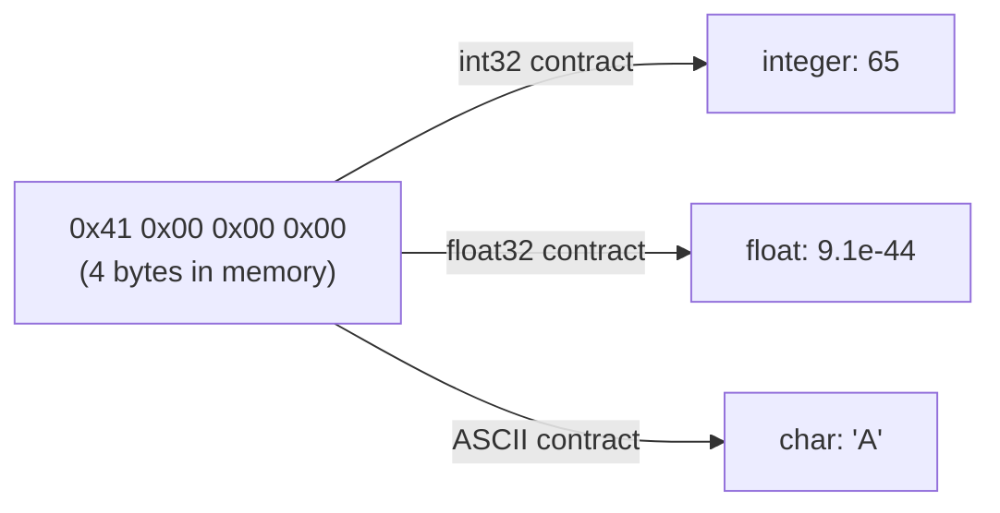

---

## Quick foundation: signed vs unsigned integers

Before going any further, a quick bit of groundwork.

**Unsigned integer**: all bits represent a positive number. An 8-bit unsigned integer holds 0 to 255.

**Signed integer**: the leftmost bit is a sign bit. `0` means positive, `1` means negative. An 8-bit signed integer holds −128 to +127.

Same 8 bits. Different interpretation contract.

The CPU has *separate instructions* for signed and unsigned arithmetic because the maths differs. Signed multiplication uses `IMUL`. Unsigned multiplication uses `MUL`. The bits going in are identical — but the instruction treats them differently, and the result reflects whichever contract you chose.

This is the first concrete example of types mattering at the hardware level before you've touched a programming language.

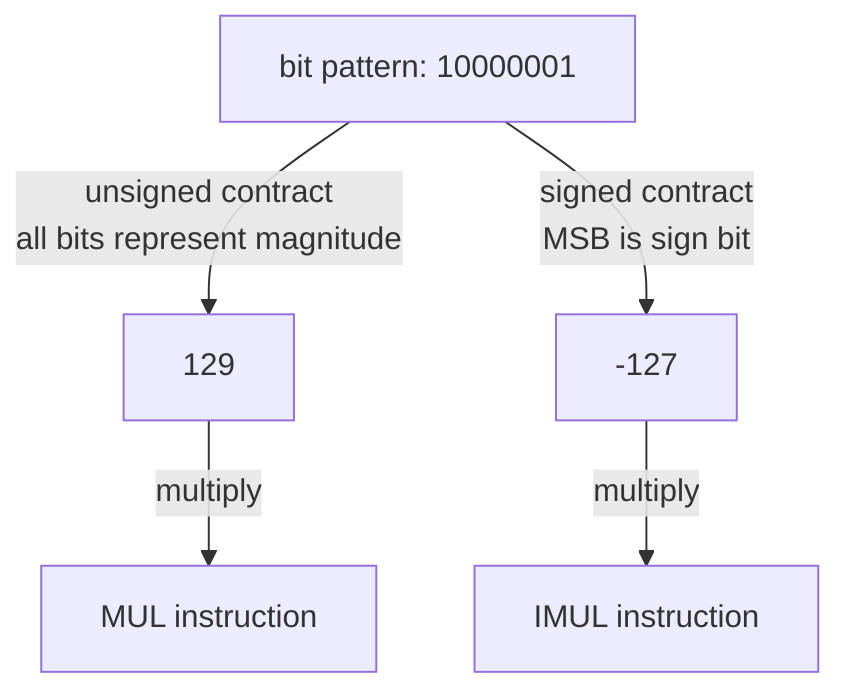

---

## How the CPU uses types: instruction selection

The CPU has different instructions for different data kinds:

- `ADD` — integer addition
- `FADD` — floating point addition (completely different operation on the same bits)
- `IMUL` — signed integer multiply
- `MUL` — unsigned integer multiply

When you write `3 + 4` in any language, something has to decide which instruction to emit. It can only make that decision if it knows what the values are.

**This is the entire game of typing.** Figuring out which CPU instruction to use, and catching cases where the answer would be nonsensical.

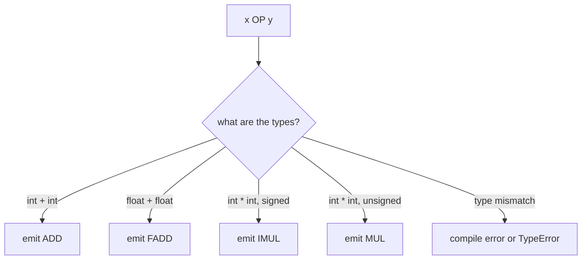

---

## Static typing: the compiler does the detective work

In statically typed languages — C, Go, Rust, Java — the **compiler** resolves all types before the program runs. You declare the contract upfront:

```java
int x = 5;
```

The compiler checks every operation. It knows `x` is an integer, it emits integer instructions, it refuses to compile if you try to use `x` in a way that doesn't make sense for an integer.

By the time the program becomes a binary, **there are no types left**. They've been consumed. They did their job: they told the compiler which instructions to emit. The runtime inherits a set of machine instructions with no type metadata attached.

This is why static typing is fast: zero runtime overhead from types, and the compiler can optimise aggressively because it knows exactly what everything is before it generates a single instruction.

The cost is upfront strictness — you have to tell the compiler, and it refuses to guess.

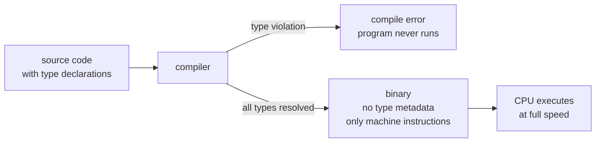

---

## Dynamic typing: types travel with the data at runtime

In dynamically typed languages — Python, JavaScript — types are resolved **while the program runs**.

Every value carries metadata about what it is. In CPython, the number `5` in memory isn't just the integer 5. It's a `PyObject` struct containing a type pointer, a reference count, and then the value. Every single Python value has this overhead attached.

Before any operation, the runtime inspects these labels. `x + y` in Python:

1. What's the type of `x`?
2. What's the type of `y`?
3. Both integers? Use integer addition.
4. One's a string? Raise a `TypeError`.

This is called **dynamic dispatch**. It happens on every operation, at runtime.

Python is slower than C not because its algorithms are worse. It's because Python is running a full type investigation on top of every single CPU operation. The CPU instruction still runs at full speed — there's just a lot more work happening before it gets called.

The payoff is flexibility. Functions can accept anything. Variables can change type mid-program. You don't have to declare what you expect.

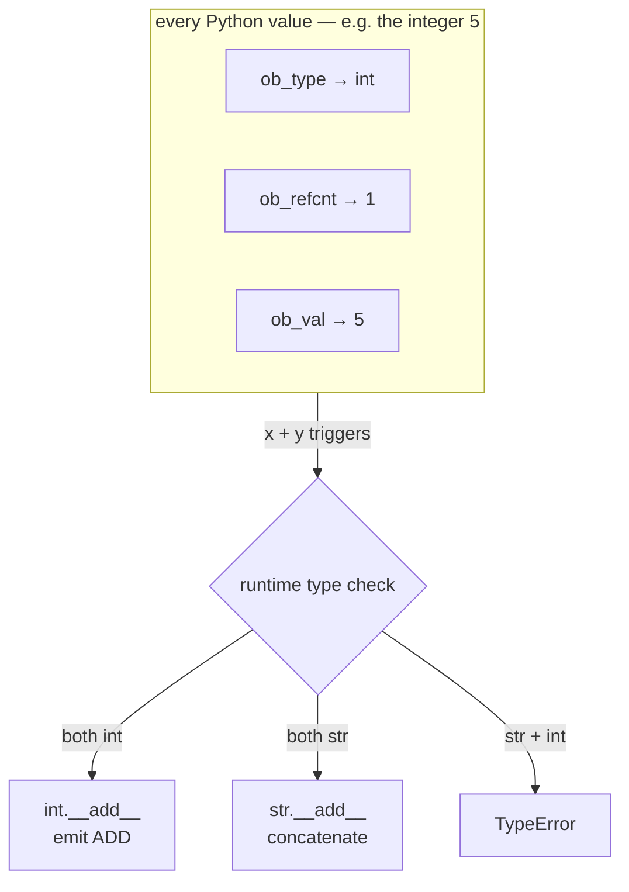

---

## Strong vs weak: a completely separate axis

Static vs dynamic describes *when* types are resolved. Strong vs weak describes *how forgiving* the language is when types don't match.

**Strongly typed**: throws an error (or refuses to compile) when types are mixed without being explicit.

**Weakly typed**: automatically coerces values when types don't match.

Python is dynamically typed but strongly typed. `"hello" + 5` raises a `TypeError` at runtime. Python knows the types, checks them, and refuses to guess what you meant. No coercion.

JavaScript is dynamically typed and weakly typed. `"5" + 3` produces `"53"` — the number was silently converted to a string. But `"5" - 3` produces `2` — the string was silently converted to a number. The inconsistency isn't a bug, it's the design: each operator makes its own coercion decision.

These are two different questions. The 2×2:

|  | **Strongly typed** | **Weakly typed** |
|---|---|---|
| **Static** | Rust, Haskell — compiler catches everything | C — compiler checks types but allows silent casts |
| **Dynamic** | Python, Ruby — flexible, won't silently mangle types | JavaScript, PHP — maximum flexibility, maximum surprises |

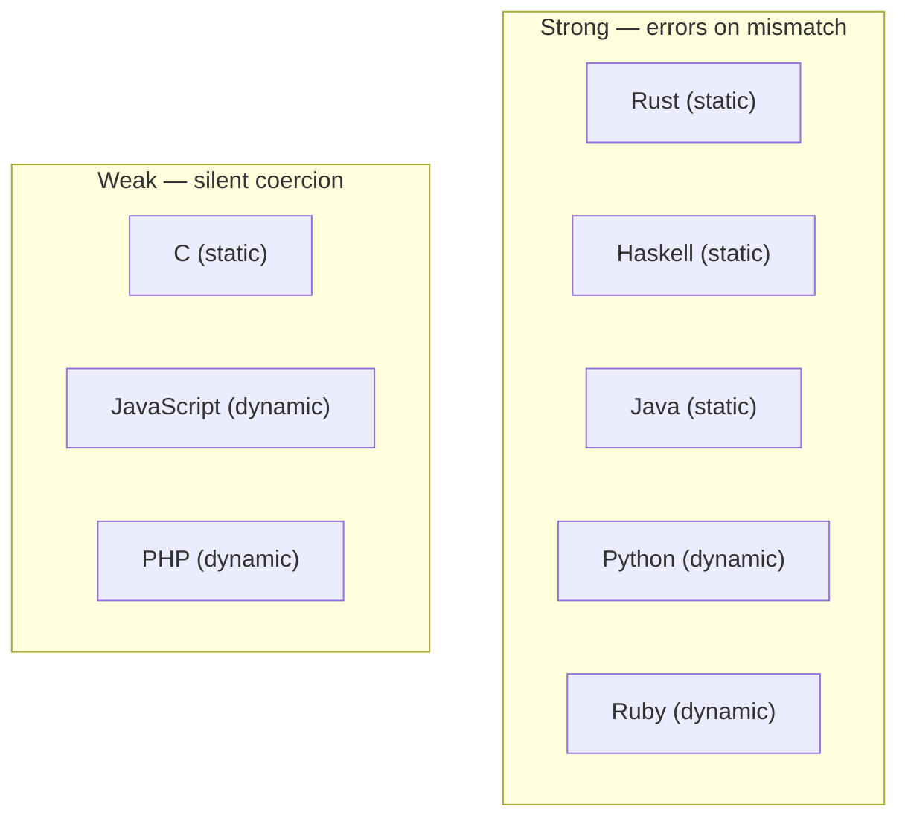

---

## Is weak typing just blind bit operations?

Not quite — there's a spectrum worth distinguishing.

**C** is the closest to genuinely blind. Cast a pointer to an integer and the compiler does it. That's a real bit reinterpretation. It's at least predictable: you asked for it, you got it. The contract changed, the bits stayed the same.

**JavaScript** actually *does* check types first. It just chooses to coerce instead of error, and does so inconsistently depending on the operator. That's arguably worse than blind, because you can't predict the output without memorising operator-specific coercion tables.

More accurate spectrum:
- **C** — minimal type investigation, genuine bit reinterpretation, predictable
- **JavaScript** — full investigation, coerces instead of erroring, inconsistently by operator
- **Python** — full investigation, errors on mismatch, predictable
- **Rust** — full investigation at compile time, cannot produce a mismatch at runtime

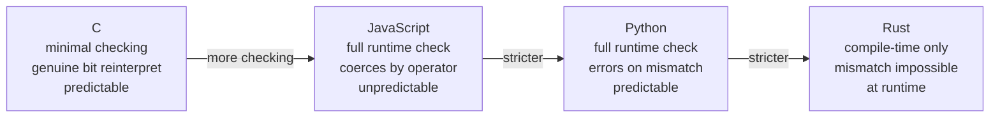

---

## Java autoboxing: the secretary, not the rogue

Java has primitive types (`int`, `long`, `double`) and corresponding object wrappers (`Integer`, `Long`, `Double`). Primitives are raw values on the stack. Wrappers are heap-allocated objects.

Autoboxing is the automatic conversion between the two. If you write:

```java
Integer x = 5;
```

The compiler rewrites this to:

```java
Integer x = Integer.valueOf(5);
```

You never wrote that conversion. The compiler inserted it.

This looks like weak typing. It isn't. Here's the distinction: **the compiler knows exactly what it's doing**. The type information is present throughout the process. An explicit, safe, fully-understood conversion is generated. The contract is never ambiguous.

Compare to JavaScript's `"5" - 3 = 2`. That's not a principled conversion — it's a runtime guess that varies by operator. No explicit rule, no static verification, no predictability.

The rule: **strong typing means conversions are explicit and safe, even when the syntax hides them. Weak typing means the runtime fills in blanks the programmer left open.**

Java autoboxing is a compiler feature. It's strongly typed. The secretary inserted the correct form — the clerk at the desk didn't make something up.

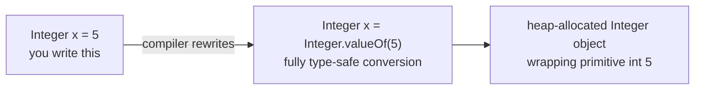

---

## Type erasure: static typing taking it further

Java generics are where static typing gets philosophically interesting.

When you write `List<String>`, the compiler fully type-checks everything. It refuses to let you insert an `Integer`. Catches every mismatch at compile time.

But when it emits bytecode, it **erases the generic type parameter**. At runtime, `List<String>` and `List<Integer>` are both just `List`. The compiler also inserts casts wherever needed — if you pull a value from a `List<String>`, the compiler has already written a `(String)` cast into the bytecode. You never see it.

Practical consequence: at runtime, Java cannot tell `List<String>` from `List<Integer>`:

```java
List<String> strings = new ArrayList<>();
List<Integer> ints = new ArrayList<>();
System.out.println(strings.getClass() == ints.getClass()); // true
```

This is why `if (x instanceof List<String>)` is a compile-time error. That information doesn't exist at runtime. It was never meant to.

**Why?** Backwards compatibility. Generics were introduced in Java 5. The JVM predated them. Rather than break every existing `List` implementation, the language designers made generics a compile-time fiction that evaporates before the runtime ever sees it.

Type erasure is static typing doing its full job at compile time, then discarding *more* type information than usual. The types were always scaffolding — they let the compiler build correct, safe code, and then they were deliberately thrown away.

Contrast with C# **reification**: generic type information is preserved at runtime. `List<string>` and `List<int>` are genuinely different types in the CLR. More powerful — but it required designing the runtime with generics in mind from the start. Java didn't have that luxury.

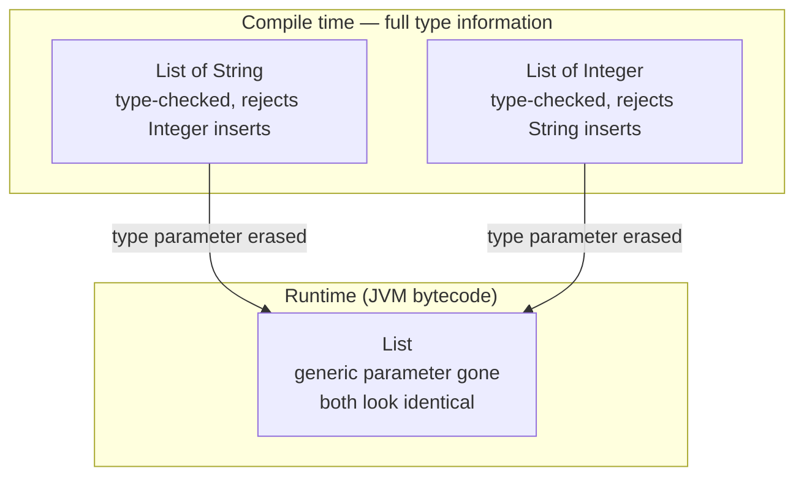

---

## Decorators: where dynamic typing earns its keep

*(Optional sidebar — but worth it.)*

In Python, functions are values. You can pass them around, return them from other functions, assign them to variables. This is a first-class property of the language.

A **decorator** is a function that takes a function and returns an enhanced version of it:

```python
def timer(func):
    def wrapper(*args, **kwargs):
        start = time.time()
        result = func(*args, **kwargs)
        print(f"{func.__name__}: {time.time() - start:.3f}s")
        return result
    return wrapper

@timer
def process_data(df):
    ...
```

`@timer` is identical to writing `process_data = timer(process_data)`. The decorator wraps the original function in a new one that times it, then replaces it.

The `wrapper` function doesn't know or care what `process_data` does, what arguments it takes, or what it returns. Types are resolved at runtime, so the wrapper works on any function.

In static languages this requires more machinery: macros in Rust, annotations and reflection in Java. Python does it in ten lines because functions are first-class values and type investigation happens at call time, not ahead of it.

This is metaprogramming — code that restructures other code at runtime, before execution. It's a genuine capability, not a workaround for missing features.

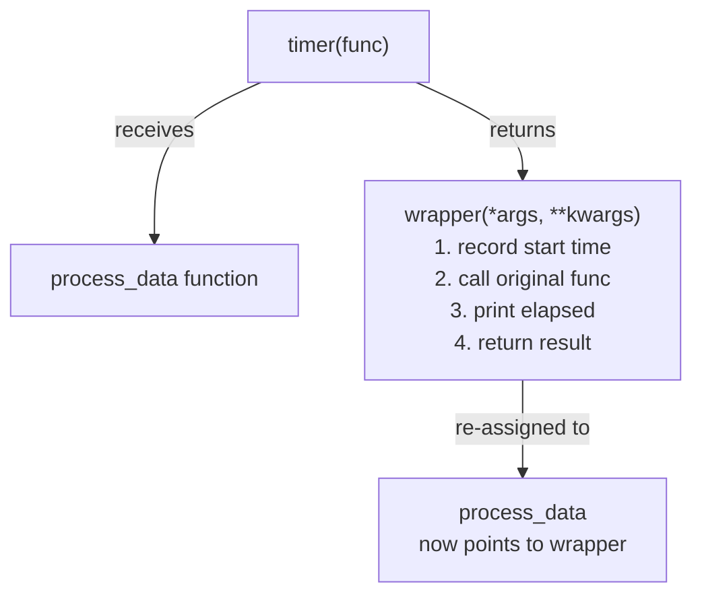

---

## Has AI made weak and dynamic languages obsolete?

The traditional argument for dynamic languages was **developer velocity** — less boilerplate, more expressiveness, faster to write.

If AI collapses the cost of writing verbose, explicitly typed code, that argument largely evaporates. You can describe what you want and the AI produces fifty lines of type-annotated Java. The friction is gone.

The signs are already there:
- TypeScript has largely won over JavaScript for serious production code
- Python type hint adoption is accelerating — mypy, pyright, and Pyrefly are standard tools now
- AI coding assistants perform *better* on typed code, because type signatures are structured documentation the model can reason about

**Weak typing's days are probably numbered.** Its main justification was convenience, and that justification is collapsing.

**Dynamic typing survives** — not for convenience, but for genuine runtime use cases:
- Metaprogramming (decorators, Ruby's `method_missing`)
- Data at the boundary (JSON parsing, CSV ingestion, user input — you don't know the shape until runtime)
- Exploratory programming (Jupyter notebooks, rapid iteration)

The steelman for dynamic languages is worth sitting with. The bottleneck was never keyboard speed — it was **cognitive load**. Fifteen lines of Python keeps the whole problem in your head. Sixty lines of Java, even AI-generated Java, is more surface to reason about. You still have to read it, hold it in working memory, debug it. That gap doesn't fully close.

The trajectory looks like **gradual typing winning**. Python with type hints, TypeScript as a typed superset of JavaScript, Dart. Typed where it helps — at API boundaries, function signatures, shared interfaces. Dynamic where it genuinely earns its keep — at runtime, at boundaries, in exploratory contexts.

The future isn't strictly typed everything. It's typed precisely where it matters, and annotated clearly enough that both humans and AI can reason about it.

---

## The mental model

The CPU doesn't know what a type is. RAM is bytes. A type is a contract about how to interpret those bytes — and the entire history of programming language design is the story of who holds that contract, when it's enforced, and what happens when it's violated.

- **Static typing**: the compiler holds the contract, enforces it before the program runs, then discards it
- **Dynamic typing**: the runtime holds the contract, checks it on every operation
- **Strong typing**: violations are errors, no silent coercion
- **Weak typing**: violations trigger guesses, with varying degrees of consistency

These are two different axes. A language can be any combination of them. Python is dynamic and strong. C is static and weak. Rust is static and strong. JavaScript is dynamic and weak.

Java is static and strong, autoboxes with the compiler as secretary, erases generics before the runtime ever sees them, and is somehow more interesting than it sounds.

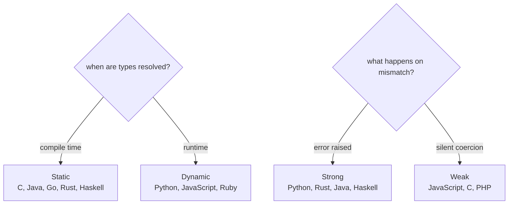

The types were always scaffolding. They help the compiler, the runtime, and you figure out which instruction to emit. Once that decision is made, the bytes are just bytes again.

---

## Books referenced

This post draws on concepts from the following:

- ***Computer Systems: A Programmer's Perspective*** (3rd ed.) — Randal E. Bryant and David R. O'Hallaron (Pearson, 2015). The hardware layer underpinning this entire post: bytes as sequences with no inherent meaning, CPU instruction selection, signed vs unsigned arithmetic. Chapters 1 and 2 are directly relevant.

---

## Engineering Notes

The following notes from my ongoing study sit alongside this post. The computer systems notes are the most direct companion reading; the rest are from the broader learning arc.

**Computer Systems** *(Computer Systems: A Programmer's Perspective — Bryant & O'Hallaron)*

- [Hardware Organisation and the Storage Hierarchy]() — the CPU, the fetch/decode/execute loop, instruction set architecture
- [Data Representation: Integers, Floats, and Endianness]() — bytes as interpretation contracts, two's complement, signed vs unsigned, IEEE 754
- [OS Abstractions: Processes, Threads, and Virtual Memory]() — virtual address space layout, context switching, Amdahl's Law

**Networking** *(Computer Networking: A Top-Down Approach — Kurose & Ross)*

- [HTTP]()
- [DNS]()
- [Email, P2P, and CDNs]()

**Data Engineering**

- [DBMS Architecture]() *(Database Internals — Alex Petrov)*
- [MySQL Architecture]() *(High Performance MySQL)*
- [Lakehouse Storage Formats]() *(Lakehouse Essentials)*
- [Dimensional Modelling]() *(The Data Warehouse Toolkit — Kimball & Ross)*

**Platform Engineering**

- [Kubernetes Control Plane]() *(Kubernetes Deep Dive — Nigel Poulton)*
